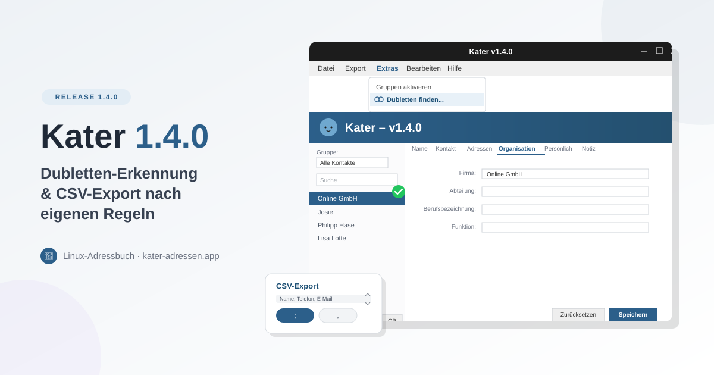

# Kater 1.4.0 – Ordnung ins Adressbuch bringen

**28. September 2026**

Wer über Jahre Kontakte importiert, aus Thunderbird übernimmt oder mehrfach von Hand
einträgt, kennt das Problem: Irgendwann steht „Anna Müller" dreimal im Adressbuch –
einmal mit Handynummer, einmal mit E-Mail, einmal mit beidem. Kater 1.4.0 räumt auf.

---

## Dubletten-Erkennung

Neu unter **Extras → Dubletten finden...**: Kater durchsucht das Adressbuch nach
Kontakten mit gleichem Namen, gleicher E-Mail-Adresse oder gleicher Telefonnummer.

Gefundene Dubletten landen in einem **Seite-an-Seite-Vergleich**. Dort entscheidest du
Feld für Feld, welche Version bleibt – abweichende Werte wählst du einzeln aus.
Telefonnummern, E-Mail-Adressen und Adressen werden beim Zusammenführen automatisch
dedupliziert statt einfach überschrieben, und die Gruppenzugehörigkeit bleibt erhalten.

## CSV-Export nach eigenen Regeln

Der CSV-Export war bisher fest vorgegeben. Jetzt bestimmst du selbst:

- **Welche Felder** exportiert werden
- **In welcher Reihenfolge** die Spalten stehen – per ↑/↓ sortierbar
- **Welches Trennzeichen** verwendet wird – Semikolon oder Komma, je nachdem was die
  Zielanwendung erwartet

## Aufgeräumtes Menü

Die Exportfunktionen waren über mehrere Menüs verstreut. Jetzt gibt es einen zentralen
Menüpunkt **Export**, der vCard-, CSV-, Fritzbox- und Speedport-Export bündelt. Die
Importfunktionen findest du gesammelt unter **Datei → Import**.

---

## Download & Installation

Alles Wissenswerte – Download, Screenshots, Features – findest du auf der offiziellen
Kater-Webseite [kater-adressen.app](https://kater-adressen.app/).

Wie gewohnt als **AppImage** – herunterladen, ausführbar machen, fertig.

Für eine saubere Desktop-Integration (Starter, Menüeintrag) gibt es zusätzlich ein
`install.sh`-Script:

```bash
chmod +x install.sh
./install.sh Kater-x86_64.AppImage
```

Startet Kater nicht? `./install.sh --repair` behebt fehlende Abhängigkeiten.

**Arch Linux / CachyOS:** Kater ist im **AUR** verfügbar:

```bash
yay -S kater-bin
```

Alles auf der [Kater-Projektseite](https://muggelbude.it/projects/kater.html).

---

## Open Source

Kater ist unter der **GPLv3** lizenziert – Code offen auf GitHub.

**Mehr Infos:** [Webseite](https://kater-adressen.app/) |
[Projektseite](https://muggelbude.it/projects/kater.html) |
[GitHub](https://github.com/nicolettas-muggelbude/Kater)
