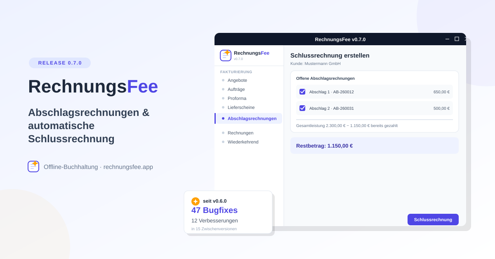

# RechnungsFee 0.7.0 – Abschläge, die sich von selbst verrechnen

**10. Oktober 2026**

Wer größere Projekte abrechnet, kennt das: Erst eine Anzahlung, später noch eine Teilzahlung,
am Ende die Schlussrechnung – und von Hand nachhalten, was davon schon bezahlt wurde, wird
schnell unübersichtlich. RechnungsFee 0.7.0 nimmt einem genau das ab.

---

## Abschlagsrechnungen & automatische Schlussrechnung

Neuer, optional aktivierbarer Dokumenttyp unter **Einstellungen → Unternehmen → Funktionen**:
die Abschlagsrechnung. Keine Mini-Variante der normalen Rechnung – eine Abschlagsrechnung ist
eine vollwertige, steuerlich wirksame Rechnung. Zahlung, Mahnwesen, Storno, Kontokorrent und
ZUGFeRD-Export funktionieren damit genau wie bei jeder anderen Rechnung auch.

Der eigentliche Clou zeigt sich beim Schreiben der Schlussrechnung: Ein neuer Auswahl-Dialog
listet alle offenen Abschlagsrechnungen des Kunden auf (eingeschränkt auf den überlappenden
Leistungszeitraum, falls gesetzt). Ankreuzen genügt – RechnungsFee zieht automatisch den
tatsächlich gezahlten Betrag ab, auch bei Unter- oder Überzahlung. Ist das Formular noch leer,
übernimmt die Schlussrechnung sogar die Original-Position(en) der Abschlagsrechnung als eigene,
frei editierbare Leistung.

Und für den Fall, dass die Summe der Abschläge die Gesamtleistung übersteigt: Die Schlussrechnung
darf dann auch negativ werden, statt blockiert zu werden – der Kunde hat ein Guthaben, und eine
Zahlung darauf ist dann korrekt eine Rückerstattung statt einer Einnahme.

Das Feature kam als Vorschlag aus der Community – danke an **abgebytezt** für die Anregung und
**Peter1061** für die hilfreiche Einschätzung zur Abzugsbasis (Issue #419).

---

## 47 Bugfixes und 12 Verbesserungen seit v0.6.0

Bis v0.7.0 fertig war, lagen 15 Zwischenversionen dazwischen (v0.6.1 bis v0.6.15) – in Summe
**47 Bugfixes** und **12 Verbesserungen**, dazu rund 20 weitere kleinere Funktionen. Ein kurzer
redaktioneller Rückblick, was davon am meisten hängen geblieben ist:

- **Der Thunderbird-Versand brauchte fünf Anläufe.** Als Alternative zu SMTP eingeführt (v0.6.5),
  fand er auf Windows zunächst die falschen Installationspfade (v0.6.6), blieb dann in
  Wartestellung hängen (v0.6.6), wurde von einem Sicherheitsmechanismus der App-Plattform komplett
  blockiert (v0.6.7) und bekam danach zu weitreichende Rechte zugewiesen (v0.6.8) – erst v0.6.10
  hat ihn auf allen drei Betriebssystemen zuverlässig zum Laufen gebracht.
- **Steuerliche Korrektheit war der große rote Faden.** Die Kleinunternehmer-Regelung (§19 UStG)
  wurde an einem halben Dutzend bisher übersehener Stellen nachgezogen – Artikel, wiederkehrende
  Rechnungen, Buchungsvorlagen, Eingangsrechnungen. Dazu kamen mehrere Korrekturen an den
  UStVA-Kennziffern rund um §13b und Reverse-Charge, teils bis zurück zu Alt-Buchungen.
  Auffällig viele dieser Berichte kamen von **ludgerknorps**, **derdobbi** und **UweKoslowski** –
  danke für die gründliche Fehlersuche.
- **Linux-spezifische PDF-Anzeige gleich zweimal geflickt** – einmal der native Kalender unter
  WebKitGTK, der sich nicht mehr schloss, einmal ein komplett leeres PDF-Fenster unter KDE
  Plasma/Wayland.

Nebenbei sind auch ein paar spürbare Features mit eingeflossen, die keine eigene Ankündigung
bekommen haben: eine **Kontokorrent-Übersicht** über alle Kunden und Lieferanten mit offenem
Saldo, ein Menüpunkt für **offene Verbindlichkeiten** samt Skonto-Frist, ein **GoBD-Änderungs­protokoll**
für nachträgliche Software-Eingriffe, und die Länderauswahl ist von 39 auf alle 196 Staaten
gewachsen.

---

## Download & Installation

RechnungsFee gibt's für **Windows**, **Linux** (AppImage) und **macOS** (Apple Silicon) –
alle Downloads inklusive SHA256-Prüfsummen auf der [RechnungsFee-Webseite](https://rechnungsfee.app/).

Für gescannte Belege und Kassenbons per OCR wird zusätzlich **Tesseract** benötigt – der
Linux-Installer bietet die Installation automatisch an, unter Windows übernimmt das der
Setup-Assistent gleich mit.

---

## Open Source

RechnungsFee ist unter der **AGPLv3** lizenziert – Code offen auf GitHub, und Vorschläge aus
der Community sind ausdrücklich willkommen, wie die Abschlagsrechnungen in dieser Version
gezeigt haben.

**Mehr Infos:** [Webseite](https://rechnungsfee.app/) |
[Projektseite](https://muggelbude.it/projects/rechnungsfee.html) |
[GitHub](https://github.com/nicolettas-muggelbude/RechnungsFee)
